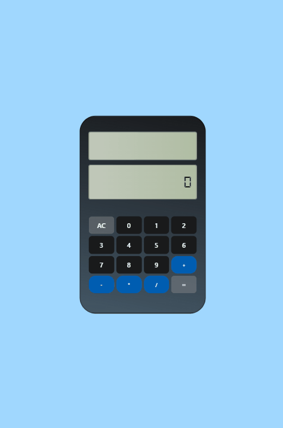

# Calculadora Simples / React.js
## Sobre o projeto
Meu primeiro projeto em React.js é uma calculadora de cálculos simples, desenvolvida com HTML, CSS e JavaScript. O objetivo principal é oferecer uma interface intuitiva para operações matemáticas básicas. A aplicação, baseada em React.js, proporciona uma experiência interativa e destaca-se pela simplicidade e eficiência no uso. 
 ## Layout

 

   

 

## Tecnologias utilizadas

   

## O que eu aprendi

Neste projeto, expandi minha compreensão sobre JSX, aprofundei-me na criação e utilização de componentes, pude tambem  desenvolvolver habilidades na manipulação do estado da aplicação, compreendendo como as atualizações dinâmicas ocorrem de forma reativa.  Esse projeto representou uma base sólida para minha jornada no universo React, abrindo portas para explorar aspectos mais avançados no futuro.

## Acesso a página

Para ver o projeto pronto [clique aqui ](https://claricassia.github.io/Projeto-QR-code/)

